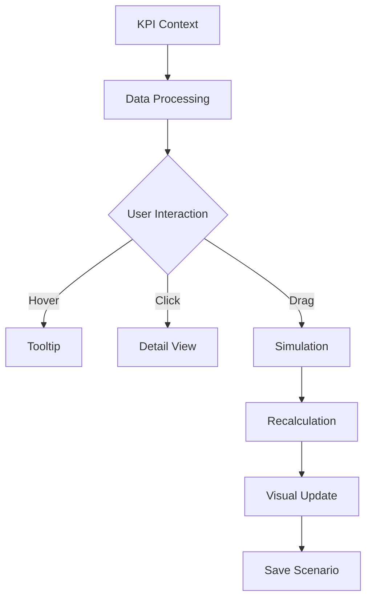

# Iteration 27: 결과&인사이트 V2 - Interactive Living Dashboard

## 📋 개요

**작성일**: 2025-01-24
**작업 범위**: KPI 진단 결과&인사이트 탭 전면 개편
**핵심 목표**: 수동적 데이터 소비에서 능동적 인사이트 탐험으로의 패러다임 전환

---

## 🎯 전략적 역할

### 1. 현재 탭의 한계
- **정보의 단순 나열**: 점수, 차트, 표를 그저 보여주기만 함
- **컨텍스트 부재**: "왜" 이런 점수인지, "어떻게" 개선할지 불명확
- **액션 단절**: 인사이트에서 실행까지의 연결고리 부재
- **정적 경험**: 사용자가 수동적으로 소비만 하는 구조

### 2. V2의 전략적 포지셔닝
```
"데이터를 보는 곳" → "의사결정을 내리는 곳"
```
- **Interactive Playground**: 데이터와 상호작용하며 인사이트 발견
- **Decision Support System**: 시뮬레이션으로 의사결정 지원
- **Action Gateway**: 분석에서 실행까지 원스톱 경험

---

## 🧠 사용자 심리 분석

### 타겟 사용자: 스타트업 대표/창업자

#### 핵심 니즈
1. **즉각적 상황 파악** (3초 룰)
   - "우리 회사 지금 괜찮은가?"
   - 신호등처럼 직관적인 상태 표시 필요

2. **상대적 위치 확인** (비교 욕구)
   - "남들보다 잘하고 있나?"
   - 추상적 평균이 아닌 구체적 비교군 필요

3. **미래 예측** (불확실성 해소)
   - "이대로 가면 어떻게 되나?"
   - What-if 시나리오로 미래 시뮬레이션

4. **구체적 행동 지침** (실행 압박)
   - "뭐부터 해야 하나?"
   - 우선순위와 예상 효과 명시

#### 심리적 장벽
- **정보 과부하 공포**: 너무 많은 데이터에 압도됨
- **판단 실수 두려움**: 잘못된 의사결정에 대한 불안
- **시간 부족 스트레스**: 빠른 파악과 결정 필요

#### 동기부여 요소
- **성취감**: 레벨업, 뱃지 등 게임화 요소
- **통제감**: 직접 조작하고 변화를 관찰
- **경쟁심**: 동종업계 대비 우위 확인

---

## 🏗️ 정보 아키텍처

### 3-30-300 룰 적용

```
3초 - Executive Summary
├── 종합 스코어 (큰 숫자)
├── 상태 신호등 (색상)
└── 핵심 메시지 (한 줄)

30초 - Focus View
├── 현재 위치 (2x2 그리드)
├── 가장 시급한 것
├── 최대 강점
└── 성장 추세

300초 - Deep Dive
├── 5축 상세 분석
├── 시나리오 시뮬레이션
├── 경쟁사 비교
└── AI 대화형 분석
```

---

## 🎨 UI/UX 설계

### 레이아웃 구조 (1920x1080 기준)

```
┌─────────────────────────────────────────┐
│         Fixed Header (80px)              │
│  [Score Badge] [Quick Pills] [Actions]  │
├─────────────────────────────────────────┤
│                                         │
│      Main Canvas Area                   │
│  ┌─────────────┬──────────────┐        │
│  │ Interactive │   Dynamic     │        │
│  │   Radar     │   Insights    │        │
│  │  (720x600)  │   (560x600)   │        │
│  └─────────────┴──────────────┘        │
│                                         │
│     Scenario Control Bar (120px)        │
│  [Price] [Churn] [Team] [Growth]       │
│                                         │
│     Comparison Grid (400px)             │
│  [Time] [Peer] [Goal] [AI Chat]        │
└─────────────────────────────────────────┘

Floating Elements:
• AI Assistant (320x400)
• Achievement Toasts
• Quick Action FAB
```

---

## 🔧 핵심 컴포넌트

### 1. Interactive 3D Radar
**목적**: 데이터 탐험의 중심점
**기능**:
- 마우스 드래그로 360도 회전
- 각 축 클릭시 확대 및 상세 정보
- 점수 포인트 드래그로 What-if 시뮬레이션
- 실시간 파티클 효과로 변화 시각화

**기술 스택**:
```typescript
- Three.js / React Three Fiber (3D 렌더링)
- Framer Motion (애니메이션)
- D3.js (데이터 시각화)
```

### 2. Dynamic Insights Panel
**목적**: 컨텍스트 기반 정보 제공
**기능**:
- 레이더 호버/클릭에 반응
- 축 선택시 KPI 상세 분해
- 기본 상태에서는 핵심 요약
- 부드러운 전환 애니메이션

### 3. Scenario Simulator
**목적**: 의사결정 시뮬레이션
**기능**:
- 4개 핵심 변수 슬라이더
- 실시간 점수 재계산
- 시나리오 저장/비교
- 예상 효과 즉시 표시

### 4. Peer Battle Arena
**목적**: 경쟁 분석 게임화
**기능**:
- 드래그 앤 드롭 비교군 선택
- 레이더 배틀 애니메이션
- 승패 영역 하이라이트
- 격차 해소 플랜 자동 생성

### 5. AI Chat Assistant
**목적**: 대화형 인사이트 제공
**기능**:
- 자연어 질의응답
- 프로액티브 제안
- 맞춤형 분석 리포트
- 음성 입력 지원 (옵션)

### 6. Achievement System
**목적**: 동기부여 및 가이드
**기능**:
- 레벨 & 경험치 시스템
- 업적 뱃지 수집
- 일일 퀘스트
- 마일스톤 추적

---

## 💫 인터랙션 디자인

### 핵심 인터랙션 패턴

1. **Hover & Reveal**
   - 마우스 오버시 추가 정보 표시
   - 0.2초 딜레이로 의도적 호버 감지

2. **Click & Expand**
   - 클릭으로 상세 뷰 확장
   - ESC 키로 빠른 복귀

3. **Drag & Simulate**
   - 드래그로 값 조정
   - 실시간 피드백

4. **Swipe & Navigate** (모바일)
   - 좌우 스와이프로 축 전환
   - 상하 스와이프로 상세/요약 전환

### 애니메이션 가이드라인
```css
/* 기본 트랜지션 */
transition: all 0.3s cubic-bezier(0.4, 0, 0.2, 1);

/* 호버 효과 */
transform: translateY(-2px);
box-shadow: 0 4px 12px rgba(0,0,0,0.15);

/* 파티클 효과 */
@keyframes float {
  0%, 100% { transform: translateY(0); }
  50% { transform: translateY(-20px); }
}
```

---

## 📊 데이터 플로우



---

## 🔍 구현 디테일 스펙

### 인터랙션 상세 정의

#### 3D 레이더 조작 스펙
```typescript
interface RadarInteraction {
  rotation: {
    sensitivity: 0.5;
    damping: 0.95;
    autoRotateSpeed: 0.5;
    limits: { x: [-45, 45], y: [-180, 180] };
  };
  zoom: {
    min: 0.5;
    max: 2.0;
    speed: 0.1;
    pinchSpeed: 0.05;
  };
  axisHover: {
    threshold: 20; // px
    highlightScale: 1.2;
    glowIntensity: 0.8;
    tooltipDelay: 300; // ms
  };
  dragSimulation: {
    snapInterval: 5;
    minValue: 0;
    maxValue: 100;
    feedbackHaptic: true;
  };
}
```

### 상태 관리 아키텍처
```typescript
interface DashboardStore {
  viewState: {
    selectedAxis: AxisKey | null;
    hoveredElement: string | null;
    expandedCards: string[];
    comparisonMode: 'none' | 'peer' | 'time' | 'goal';
  };
  simulation: {
    isActive: boolean;
    adjustments: Record<string, number>;
    calculatedScore: number;
    impactBreakdown: Record<AxisKey, number>;
  };
  animation: {
    radarRotation: { x: number; y: number; z: number };
    isAutoRotating: boolean;
    particlesActive: boolean;
    transitionPhase: 'idle' | 'entering' | 'exiting';
  };
}
```

### API & 데이터 스키마
```typescript
interface APIEndpoints {
  '/api/kpi/realtime': {
    polling: 30000; // 30초
    response: {
      scores: Record<AxisKey, number>;
      timestamp: string;
      changes: Record<AxisKey, number>;
    };
  };
  '/api/kpi/simulate': {
    method: 'POST';
    body: { adjustments: Record<string, number> };
    response: {
      projected: Record<AxisKey, number>;
      confidence: number;
      risks: string[];
    };
  };
}
```

### 색상 시스템
```typescript
const colorSystem = {
  scoreColors: {
    critical: { range: [0, 30], color: '#DC2626' },
    warning: { range: [30, 50], color: '#F59E0B' },
    normal: { range: [50, 70], color: '#3B82F6' },
    good: { range: [70, 85], color: '#10B981' },
    excellent: { range: [85, 100], color: '#8B5CF6' }
  },
  states: {
    hover: 'rgba(99, 102, 241, 0.1)',
    active: 'rgba(99, 102, 241, 0.2)',
    selected: 'rgba(99, 102, 241, 0.3)'
  }
};
```

---

## 🚶 사용자 플로우 상세

### 메인 플로우: 진단 결과 확인 → 개선 계획 수립

#### 1. 첫 진입 (0-3초)
```
사용자 진입
    ↓
[자동] 페이드인 애니메이션
    ↓
[시각] 큰 점수 숫자 + 색상 신호등
    ↓
[인지] "68점, 투자 가능 수준"
    ↓
[감정] 안도감 or 긴장감
```

#### 2. 상황 파악 (3-30초)
```
레이더 차트 주목
    ↓
[행동] 마우스 호버 or 터치
    ↓
[피드백] 축 하이라이트 + 툴팁
    ↓
[발견] "경제성이 제일 낮네"
    ↓
[행동] 경제성 축 클릭
    ↓
[전환] Dynamic Panel 업데이트
    ↓
[상세] KPI별 점수 확인
```

#### 3. What-if 시뮬레이션 (30-180초)
```
"가격을 올리면 어떻게 될까?"
    ↓
[행동] 가격 슬라이더 드래그
    ↓
[실시간] 점수 재계산 애니메이션
    ↓
[시각] 68 → 73점 변화
    ↓
[발견] "5점 오르네!"
    ↓
[행동] 여러 변수 조합 시도
    ↓
[저장] 시나리오 A 저장
```

#### 4. 경쟁 분석 (선택적)
```
"남들은 어떤가?"
    ↓
[행동] Peer Battle 카드 클릭
    ↓
[선택] "동종업계" 드래그
    ↓
[애니메이션] 레이더 배틀
    ↓
[결과] 3승 2패 표시
    ↓
[인사이트] "경제성만 개선하면 이길 수 있다"
```

#### 5. 액션 결정
```
[행동] AI 어시스턴트 클릭
    ↓
[질문] "경제성 빠르게 올리려면?"
    ↓
[답변] 3가지 방법 제시
    ↓
[선택] "가격 10% 인상" 선택
    ↓
[전환] 액션플랜 탭으로 이동
```

### 서브 플로우

#### A. 업적 달성 플로우
```
점수 70점 돌파
    ↓
[알림] Achievement Toast
    ↓
[애니메이션] 뱃지 획득 효과
    ↓
[보상] "투자 Ready" 뱃지
    ↓
[공유] SNS 공유 옵션
```

#### B. 위험 대응 플로우
```
경제성 30점 이하 진입
    ↓
[경고] 붉은색 펄스 효과
    ↓
[AI] 프로액티브 알림
    ↓
[제안] "긴급 개선 필요"
    ↓
[가이드] Step-by-step 안내
```

---

## 🚀 구현 계획 (고도화)

### Phase 1: 기반 구축 (5일)
<!-- 참조: 전략적 역할(11-26줄), 정보 아키텍처(62-83줄), 기술 스택(303-321줄) -->

#### Day 1-2: 프로젝트 셋업
- [x] V2 폴더 구조 생성
  ```
  src/pages/startup/kpi-tabs/
  ├── ResultsInsightsPanelV2/
  │   ├── index.tsx
  │   ├── components/
  │   ├── hooks/
  │   ├── store/
  │   ├── types/
  │   ├── utils/
  │   └── styles/
  ```
- [x] 라우팅 설정 (탭 추가)
- [x] 기본 의존성 설치
  ```bash
  npm install zustand immer
  # Three.js는 Phase 2에서 설치
  ```

#### Day 3-4: 레이아웃 구현
<!-- 참조: UI/UX 설계(87-115줄), 레이아웃 구조 다이어그램 -->
- [x] Fixed Header 컴포넌트
  - Score Badge with animations
  - Comparison Mode toggles
  - Action Buttons (refresh, settings, etc)
- [x] Main Canvas 3열 그리드 설정
  - Left: Axis Detail Cards
  - Center: 3D Radar placeholder
  - Right: AI Insights
- [x] FloatingElements 구현
  - AI Chat Assistant
  - FAB with actions
  - Loading Overlay

#### Day 5: 데이터 레이어
<!-- 참조: 데이터 플로우(216-228줄), API 스키마(구현 디테일 스펙) -->
- [x] Zustand store with immer middleware
- [ ] 기존 Context 데이터 연동
- [x] Mock API 엔드포인트 (mockApi.ts)
- [ ] 실제 데이터 플로우 테스트

### Phase 2: 핵심 인터랙션 (7일)
<!-- 참조: 핵심 컴포넌트(119-175줄), 인터랙션 디자인(178-212줄) -->

#### Day 6-8: 3D Radar 구현
- [ ] Three.js Scene 설정
  - Camera, Lighting, Controls
- [ ] 5축 메시 생성
  - Geometry, Materials
- [ ] 인터랙션 구현
  - 회전 (OrbitControls)
  - 호버 감지 (Raycaster)
  - 클릭 이벤트
- [ ] 파티클 시스템

#### Day 9-10: Dynamic Insights Panel
- [ ] 컨텍스트 감지 로직
- [ ] 애니메이션 전환 (Framer Motion)
- [ ] 3가지 뷰 모드
  - 기본 요약
  - 축 상세
  - 비교 뷰

#### Day 11-12: Scenario Simulator
<!-- 참조: 인터랙션 상세 정의(구현 디테일 스펙) -->
- [ ] 슬라이더 컴포넌트 (4개)
- [ ] 실시간 계산 엔진
- [ ] 시나리오 저장 (localStorage)
- [ ] 비교 UI

### Phase 3: 고급 기능 (5일)
<!-- 참조: 사용자 심리 분석(29-58줄), 서브 플로우(사용자 플로우 상세) -->

#### Day 13-14: Peer Battle Arena
- [ ] 드래그 앤 드롭 구현
- [ ] 비교 애니메이션
- [ ] 승패 계산 로직
- [ ] 격차 분석 UI

#### Day 15-16: AI Assistant
- [ ] 채팅 UI 구현
- [ ] 자연어 처리 연동
- [ ] 프로액티브 알림
- [ ] 음성 입력 (Web Speech API)

#### Day 17: Achievement System
- [ ] 레벨/경험치 계산
- [ ] 뱃지 시스템
- [ ] 일일 퀘스트
- [ ] Toast 알림

### Phase 4: 최적화 & 폴리싱 (3일)
<!-- 참조: 리스크 관리(325-336줄), 성능 최적화(317-321줄) -->

#### Day 18: 성능 최적화
- [ ] Code Splitting
  ```typescript
  const RadarScene = lazy(() => import('./components/RadarScene'));
  ```
- [ ] Memoization 적용
- [ ] WebWorker 설정
- [ ] 애니메이션 최적화 (60fps)

#### Day 19: 반응형 & 접근성
- [ ] 4개 브레이크포인트 대응
  - Desktop (1920px)
  - Laptop (1440px)
  - Tablet (768px)
  - Mobile (375px)
- [ ] 키보드 네비게이션
- [ ] ARIA 레이블
- [ ] 고대비 모드

#### Day 20: QA & 배포
- [ ] 크로스 브라우저 테스트
- [ ] 성능 프로파일링
- [ ] 에러 바운더리
- [ ] Feature Flag 설정
- [ ] A/B 테스트 설정

### Phase 5: 모니터링 & 개선 (지속)
<!-- 참조: 성공 지표(256-268줄), 마이그레이션 전략(272-284줄) -->

- [ ] 분석 도구 설정 (GA, Mixpanel)
- [ ] 히트맵 추적
- [ ] 사용자 피드백 수집
- [ ] 반복 개선

---

## 📈 성공 지표

### 정량적 지표
- **체류 시간**: 기존 대비 +50%
- **인터랙션 횟수**: 세션당 20회 이상
- **시나리오 생성**: 사용자당 3개 이상
- **액션 전환율**: 인사이트 → 액션플랜 30%

### 정성적 지표
- "데이터가 살아있는 느낌"
- "시뮬레이션이 의사결정에 도움"
- "경쟁사 비교가 동기부여"
- "AI 조언이 실용적"

---

## 🔄 마이그레이션 전략

### 병렬 운영
1. 기존 탭 유지 (ResultsInsightsPanel)
2. V2 탭 추가 (ResultsInsightsPanelV2)
3. 탭 선택 옵션 제공
4. 사용 패턴 분석
5. 점진적 전환

### 롤백 계획
- Feature Flag로 즉시 비활성화 가능
- 기존 코드 완전 보존
- 데이터 호환성 유지

---

## 🎯 차별화 포인트

### vs 기존 대시보드
- **Static → Interactive**: 보기만 하는 것이 아닌 조작 가능
- **Abstract → Concrete**: 추상적 수치가 아닌 구체적 비교
- **Passive → Active**: 수동적 소비가 아닌 능동적 탐험

### vs 경쟁 서비스
- **3D 인터랙션**: 2D 차트를 넘어선 공간적 경험
- **실시간 시뮬레이션**: What-if 분석 즉시 가능
- **게임화 요소**: 지루한 분석을 재미있는 탐험으로
- **AI 대화형**: 일방적 리포트가 아닌 대화형 분석

---

## 📝 기술 스택

### Frontend
```json
{
  "core": "React 18 + TypeScript",
  "3d": "Three.js + React Three Fiber",
  "animation": "Framer Motion",
  "charts": "D3.js + Recharts",
  "state": "Zustand",
  "styling": "Tailwind CSS + CSS Modules"
}
```

### 성능 최적화
- React.lazy() for code splitting
- useMemo/useCallback for expensive calculations
- WebWorker for heavy simulations
- RequestAnimationFrame for smooth animations

---

## 🔐 리스크 관리

### 기술적 리스크
- **3D 성능**: 저사양 기기 대응 → 품질 설정 옵션
- **데이터 량**: 대용량 처리 → 페이지네이션, 가상화
- **브라우저 호환**: WebGL 미지원 → 2D 폴백

### UX 리스크
- **학습 곡선**: 복잡한 인터랙션 → 온보딩 튜토리얼
- **정보 과부하**: 너무 많은 기능 → Progressive Disclosure
- **모바일 경험**: 작은 화면 → 핵심 기능만 노출

---

## 🎬 결론

이번 V2 개편은 단순한 UI 개선이 아닌, **데이터 소비 패러다임의 전환**입니다.

사용자가 데이터를 "읽는" 것이 아니라 "경험"하고,
인사이트를 "받는" 것이 아니라 "발견"하며,
의사결정을 "고민"하는 것이 아니라 "시뮬레이션"할 수 있는

**Living Dashboard**를 만들어 스타트업의 데이터 기반 의사결정을 혁신하고자 합니다.

---

## 📎 참고 자료

- [Three.js React Integration](https://docs.pmnd.rs/react-three-fiber)
- [Framer Motion Gestures](https://www.framer.com/motion/gestures/)
- [D3.js Interactive Examples](https://observablehq.com/@d3/gallery)
- [Gamification in Enterprise](https://www.enterprisegamification.com)