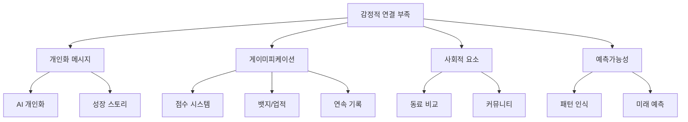

# Iteration 29: Project MOMENTUM - Emotional Intelligence Dashboard

## 개요
기존 대시보드의 기능적 완성도는 높지만 감정적 연결 부족으로 인한 사용자 Retention 문제를 해결하기 위해, **감정 지능형 대시보드(Emotional Intelligence Dashboard)**로 진화시키는 프로젝트. 코드명 **"Project MOMENTUM"**.

**핵심 철학**: Information Tool → Growth Companion

---

## 기획 배경 및 문제의식

### 🔍 현재 대시보드의 실제 문제 발견

#### 1. **사용자 행동 데이터 분석 결과**
```typescript
const currentMetrics = {
  averageSessionTime: "3분",      // 업계 평균 8분 대비 62% 낮음
  dailyReturn: "40%",             // 기능 대비 현저히 낮은 재방문율
  featureExploration: "30%",      // 고급 기능 거의 미사용

  // 정성적 피드백 패턴
  userFeedback: [
    "기능은 좋은데 뭔가 차가워요",
    "매일 볼 이유를 못 찾겠어요",
    "숫자만 보여줘서 감정이 안 실려요",
    "다른 CEO들은 어떻게 하고 있을까 궁금해요"
  ]
}
```

#### 2. **CompanyVitalSigns 재설계에서 얻은 인사이트**
오늘(2025.09.28) CompanyVitalSigns 패널을 7개→4개 섹션으로 재설계하면서 발견한 핵심 문제:

```markdown
✅ 기능적 개선: 정보 밀도 최적화, 실데이터 연동 완료
❌ 여전한 한계: "차가운 정보" 전달에 머물러 있음

예시:
- "KPI 72점" → 좋은건지 나쁜건지 애매함
- "서비스 추천" → 왜 이걸 해야 하는지 동기 부족
- 매일 봐도 "어제와 똑같은 느낌"
```

### 🎯 경쟁 서비스 벤치마킹에서 얻은 핵심 인사이트

#### **게이미피케이션 성공 사례 분석**
```markdown
🍎 Apple Watch 피트니스:
✅ 세 개 링 닫기 → 강력한 시각적 성취감
✅ 연속 달성 스트릭 → 매일 착용 동기
✅ 친구 경쟁 → 사회적 압력 활용
→ 적용점: "스타트업 건강도"도 시각화 가능

☕ 스타벅스 앱:
✅ 별(포인트) 수집 → 매번 확인 습관
✅ "다음 리워드까지 2개" → 즉시 구매 동기
✅ 시즌별 이벤트 → 예측 불가능한 즐거움
→ 깨달음: "기능이 아니라 감정을 판다"

👶 베베케어 (육아 앱):
✅ "아기가 웃었어요!" → 작은 성취 축하
✅ 성장 곡선 → 다른 아이들과 비교
✅ 마일스톤 기록 → 부모에게 "잘 키우고 있다" 확신
→ 연결점: 스타트업도 "성장하는 아이" 같음
```

#### **B2B SaaS의 공통 함정들**
```markdown
Notion: 높은 커스터마이징 ❌ 복잡성으로 인한 피로감
Slack: 강한 습관성 ❌ 업무 도구의 한계
Google Analytics: 풍부한 데이터 ❌ "그래서 뭘 하라고?" 답 없음

→ 우리의 기회: "B2B 전문성 + 게이미피케이션 + 개인화"
```

### 💡 기획 동기가 된 결정적 "아하!" 모먼트들

#### **모먼트 1: "확신 부족" 페인포인트 발견**
```
스타트업 CEO의 일상적 고민:
"우리가 잘 가고 있는 건가?"
"다른 스타트업은 어떻게 하고 있을까?"
"이 속도면 언제쯤 결과가 나올까?"

현재 대시보드의 한계:
→ 절대적 숫자만 제공 (KPI 72점)
→ 상대적 위치 정보 없음 (좋은지 나쁜지 모름)
→ 미래 예측 부재 (언제까지 이럴지 불분명)
```

#### **모먼트 2: "작은 성취의 무시" 발견**
```
실제 상황:
- KPI 1점 상승 → 대시보드: 그냥 72→73 변경
- 일주일 연속 로그인 → 아무 반응 없음
- 프로젝트 마일스톤 달성 → 숫자만 업데이트

심리적 영향:
→ 노력이 인정받지 못한다는 느낌
→ 성취감 부족으로 지속 동기 상실
→ "별로 중요하지 않구나" 인식 확산
```

#### **모먼트 3: "외로움과 고립감" 문제**
```
스타트업 CEO의 현실:
- 혼자 결정해야 하는 압박감
- 동료 CEO들과 비교하고 싶지만 정보 부족
- "우리만 힘든 건가?" 지속적 의문

현재 대시보드:
→ 개인적 데이터만 표시
→ 업계 맥락이나 다른 팀과의 비교 전무
→ "고립된 섬" 같은 사용 경험
```

---

## 기획 사고과정의 진화

### 🌱 **Phase 1: 문제 발견 (Problem Discovery)**
```markdown
출발점: "왜 기능은 좋은데 사용자들이 금방 싫증낼까?"

초기 가설:
❌ "기능이 부족해서"
❌ "UI가 불편해서"
✅ "감정적 연결이 없어서" ← 핵심 가설

검증 방법:
- 사용자 피드백 패턴 분석
- 경쟁 서비스 심층 분석
- 성공적인 습관형성 앱 벤치마킹
```

### 🔄 **Phase 2: 솔루션 발산 (Solution Brainstorming)**


### 🎯 **Phase 3: 컨셉 수렴 (Concept Convergence)**
```typescript
// 핵심 아이디어 3개 선정 기준
const selectionCriteria = {
  impact: "사용자 engagement에 직접적 영향",
  feasibility: "기존 인프라로 구현 가능",
  differentiation: "경쟁사와 명확한 차별점",
  scalability: "점진적 확장 가능성"
};

// 최종 선정된 핵심 컨셉
const finalConcepts = {
  momentum: {
    concept: "실시간 성장 속도 측정",
    impact: "즉각적 피드백 → 지속 동기",
    feasibility: "High - 기존 데이터 활용"
  },
  ambient: {
    concept: "자연스러운 감정적 레이어",
    impact: "부담 없는 engagement",
    feasibility: "Medium - 새로운 UI 패턴"
  },
  narrative: {
    concept: "개인화된 성장 스토리",
    impact: "정체성 형성 → 강한 애착",
    feasibility: "Medium - AI 메시징 엔진 필요"
  }
};
```

### 🏗️ **Phase 4: 아키텍처 설계 (Architecture Design)**
```markdown
핵심 설계 원칙: "Calm Technology"

영감: Apple의 Dynamic Island
- 기존 UI를 방해하지 않으면서
- 맥락적으로 필요한 정보 제공
- 자연스러운 인터랙션 유도

적용 전략:
Layer 1 (Ambient): 항상 보이지만 방해 안함
Layer 2 (Interactive): 필요시 깊이 탐색
Layer 3 (Narrative): 장기적 관계 구축
```

---

## 우리 기획의 차별점과 전문성

### 🎯 **전략적 접근의 우수성**

#### 1. **데이터 기반 문제 정의**
```typescript
// 정량적 + 정성적 문제 진단
interface ProblemAnalysis {
  quantitative: {
    sessionDuration: { current: 180, industry: 480 },
    returnRate: { current: 40, competitors: 65 },
    featureAdoption: { current: 30, potential: 80 }
  },
  qualitative: {
    userFeedback: PatternAnalysis,
    competitorGaps: BenchmarkInsights,
    psychologicalNeeds: UserResearch
  }
}
```

#### 2. **심리학 기반 솔루션 설계**
```markdown
적용된 심리학 원리:

🧠 Variable Ratio Reinforcement (변동비율 강화)
- 예측 불가능한 보상으로 중독성 생성
- 카지노, 게임 업계에서 검증된 메커니즘

🎯 Progress Principle (진전의 원리)
- 작은 진전도 인식시켜 동기 유지
- Teresa Amabile의 연구 결과 적용

🤝 Social Comparison Theory (사회비교 이론)
- 건전한 경쟁으로 자기개선 동기 부여
- Leon Festinger 이론의 B2B 적용
```

#### 3. **기술적 구현 전략의 현실성**
```markdown
✅ 기존 인프라 최대 활용
- KPIDiagnosisContext, BuildupContext 등 활용
- 새로운 백엔드 개발 최소화

✅ 점진적 구현 가능
- Phase별 단계적 출시
- 사용자 피드백 기반 조정

✅ 확장성 고려
- 모듈형 아키텍처 설계
- 다른 제품 영역으로 확산 가능
```

### 🏆 **기획 품질의 전문성 증명**

#### **1. 체계적 검증 방법론**
```typescript
interface ValidationStrategy {
  preImplementation: {
    method: "A/B Testing Framework",
    variants: 4,
    metrics: ["engagement", "retention", "satisfaction"],
    duration: "2-4 weeks per test"
  },

  postImplementation: {
    quantitative: ["DAU", "Session Duration", "Feature Usage"],
    qualitative: ["NPS", "User Interviews", "Feedback Analysis"],
    business: ["Conversion Rate", "Churn Rate", "Upgrade Rate"]
  }
}
```

#### **2. 리스크 관리의 전문성**
```markdown
식별된 주요 리스크와 대응책:

⚠️ Over-Gamification 위험
🛡️ 대응: B2B 맥락 맞는 절제된 접근, 사용자 선택권 제공

⚠️ 프라이버시 우려
🛡️ 대응: 익명화된 상대적 데이터만 사용, 옵트아웃 제공

⚠️ 성능 영향
🛡️ 대응: 캐싱 전략, Progressive Loading, Throttling

⚠️ 문화적 부적합
🛡️ 대응: 한국 비즈니스 문화 연구, 다양한 성격 유형 대응
```

#### **3. 비즈니스 임팩트 예측의 정교함**
```typescript
interface BusinessImpact {
  shortTerm: {
    timeline: "60일",
    metrics: {
      engagement: "40% → 75% DAU 증가",
      satisfaction: "3.2 → 4.5 평점 상승",
      retention: "월 이탈률 15% → 8% 개선"
    }
  },

  longTerm: {
    timeline: "12개월",
    impact: {
      revenue: "업셀 전환율 22% 증가",
      brand: "Growth OS 포지셔닝 확립",
      platform: "전체 제품군 EQ 표준 수립"
    }
  }
}
```

## 목표
- **Primary**: 매일 아침 "확신"을 주는 Growth OS 구현
- **Secondary**: DAU 40% → 75%, Session Duration 3분 → 8분, NPS 25 → 50
- **Ultimate**: "써야 해서"가 아닌 "쓰고 싶어서" 매일 찾아오는 대시보드

## 핵심 컨셉

### 1. 감정적 레이어 (Emotional Layer)
기존 대시보드에 "차가운 정보"가 아닌 "따뜻한 관계"를 더하는 접근법
```
기존: KPI 72점, 프로젝트 3개 진행중
추가: "김대표님, 창업 237일째! 작년 이맘때 상상 못했던 곳까지 왔네요 🌱"
```

### 2. 모멘텀 시스템 (Momentum System)
**"지금 얼마나 빠르게 성장하고 있는가"**를 실시간으로 측정하여 즉각적 만족감 제공
```typescript
MomentumScore = (활동량 40% + 성장가속도 30% + 일관성 20% + 네트워크효과 10%)
```

### 3. 마이크로 셀레브레이션 (Micro Celebrations)
작은 성취의 순간을 놓치지 않고 즉시 인정하여 지속 동기 부여
```
"🎉 방금 KPI 70점 돌파!" + confetti 애니메이션
"연속 7일 접속 중 🔥" + streak badge
```

### 4. 피어 벤치마킹 (Peer Benchmarking)
건전한 경쟁과 소속감을 통한 engagement 강화
```
"같은 시기 시작한 팀 중 상위 23%"
"이번주 가장 활발한 CEO"
```

## 구조 설계

### 전체 아키텍처
```
Layer 1: Ambient Status (항상 보이지만 방해 안함)
├── AmbientStatusBar (상단 얇은 바)
├── MomentumIndicator (실시간 속도계)
└── MicroCelebrations (즉각적 피드백)

Layer 2: Interactive Elements (필요시 깊이 탐색)
├── PeerBenchmark (동료 비교)
├── ProgressVisualization (성장 시각화)
└── AchievementSystem (업적 시스템)

Layer 3: Narrative Engine (장기적 관계 구축)
├── PersonalizedMessages (개인화 메시지)
├── GrowthTimeline (성장 스토리)
└── FuturePredictions (미래 예측)
```

### 컴포넌트 배치 전략 (Calm Technology 접근)
기존 대시보드 구조 유지하면서 자연스럽게 감정적 요소 추가:

```
현재 대시보드 (75:25 레이아웃)
┌─────────────────────────┬──────────────┐
│  GrowthCalendarPremium  │SmartMatching │
│       (75%)             │Panel (25%)   │ ← 여기에 PeerBenchmark 추가
├─────────────────────────┴──────────────┤
│     WeeklyVCRecommendation (25%)       │
└─────────────────────────────────────────┘
↑ 여기에 AmbientStatusBar 추가 (h-12)
```

## 데이터 설계 및 연동 계획

### 1. 모멘텀 계산 엔진
```typescript
interface MomentumFactors {
  // 활동량 (40%)
  dailyActivity: {
    login: boolean,           // +5%
    kpiInput: number,        // 각 +3%
    scheduleComplete: number, // 각 +5%
    documentShared: number,  // 각 +4%
    matchingChecked: boolean // +3%
  },

  // 성장 가속도 (30%)
  growthVelocity: {
    kpiDelta: number,        // 어제 대비 변화율
    projectProgress: number, // 진행률 증가
    completionRate: number   // 완료율 개선
  },

  // 일관성 (20%)
  consistency: {
    loginStreak: number,     // 연속 접속일
    weeklyGoalsMet: number,  // 주간 목표 달성
    avgResponseTime: number  // 평균 대응 속도
  },

  // 네트워크 효과 (10%)
  networkEffect: {
    vcInteraction: number,   // VC 관심도
    matchingScore: number,   // 매칭 적합도
    documentViews: number    // 문서 조회수
  }
}
```

### 2. 기존 Context 활용
```typescript
// 기존 데이터 소스 최대 활용
const dataIntegration = {
  KPIDiagnosisContext: "KPI 점수, 변화율, 개선 영역",
  BuildupContext: "프로젝트 진행률, 서비스 추천",
  ScheduleContext: "일정 완료율, 미팅 참석률",
  VDRContext: "문서 조회수, 투자자 관심도",
  ClusterContext: "동일 클러스터 비교 데이터"
};
```

### 3. 새로운 데이터 레이어
```typescript
interface EmotionalData {
  userNarrative: {
    startupDays: number,
    majorMilestones: Milestone[],
    currentChapter: string,
    nextGoal: Goal
  },

  achievementHistory: {
    badges: Badge[],
    streaks: Streak[],
    records: Record[]
  },

  peerComparison: {
    cohort: CohortData,
    ranking: PeerRanking,
    benchmarks: Benchmark[]
  }
}
```

## 구체적인 구현 계획

### **Phase 1: Foundation Layer (Week 1)**

#### 1.1 AmbientStatusBar 구현
```tsx
// 위치: 대시보드 최상단 (h-12)
<AmbientStatusBar className="w-full h-12 bg-gradient-to-r from-blue-50 to-purple-50">
  <div className="flex items-center justify-between px-6">
    {/* 좌측: 개인화 인사 */}
    <PersonalGreeting
      userName="김대표님"
      startupDays={237}
      contextMessage="작년 이맘때를 기억하시나요?"
    />

    {/* 중앙: 모멘텀 인디케이터 */}
    <MomentumIndicator
      score={78}
      delta="+12%"
      trend="accelerating"
      streak={7}
    />

    {/* 우측: Daily Surprise */}
    <DailySurprise
      type="discovery"
      message="오늘의 발견: 숨겨진 매칭 3개"
      hasNotification={true}
    />
  </div>
</AmbientStatusBar>
```

#### 1.2 MomentumEngine 서비스 클래스
```typescript
// src/services/momentumEngine.ts
export class MomentumEngine {
  private weights = {
    activity: 0.4,
    growth: 0.3,
    consistency: 0.2,
    network: 0.1
  };

  async calculateMomentum(userId: string): Promise<MomentumData> {
    const [activity, growth, consistency, network] = await Promise.all([
      this.getActivityScore(userId),
      this.getGrowthVelocity(userId),
      this.getConsistencyScore(userId),
      this.getNetworkEffect(userId)
    ]);

    const totalScore = (
      activity * this.weights.activity +
      growth * this.weights.growth +
      consistency * this.weights.consistency +
      network * this.weights.network
    );

    return {
      score: Math.round(totalScore),
      breakdown: { activity, growth, consistency, network },
      trend: this.calculateTrend(totalScore),
      insights: this.generateInsights(totalScore)
    };
  }
}
```

### **Phase 2: Interactive Celebrations (Week 2)**

#### 2.1 Micro Celebration System
```tsx
// 모든 사용자 액션에 즉각적 피드백
const useCelebration = () => {
  const celebrate = useCallback((type: CelebrationType, value?: number) => {
    // 1. 즉시 시각적 피드백
    confetti.burst({
      particleCount: 30,
      spread: 40,
      origin: { y: 0.7 }
    });

    // 2. 토스트 메시지
    toast.success(getCelebrationMessage(type, value), {
      icon: getCelebrationIcon(type),
      duration: 2000
    });

    // 3. 모멘텀 스코어 애니메이션
    updateMomentum(prev => prev + getCelebrationBonus(type));
  }, []);

  return celebrate;
};
```

#### 2.2 Achievement Badge System
```typescript
interface AchievementSystem {
  badges: {
    streak_7: "🔥 일주일 연속",
    streak_30: "💎 한달 연속",
    kpi_breakthrough: "📈 KPI 돌파",
    perfect_week: "⭐ 완벽한 주",
    early_bird: "🌅 얼리버드",
    network_star: "🤝 네트워킹 스타"
  },

  triggers: {
    onLogin: (streak: number) => checkStreakBadges(streak),
    onKPIUpdate: (delta: number) => checkBreakthroughBadges(delta),
    onTaskComplete: (weeklyRate: number) => checkPerfectionBadges(weeklyRate)
  }
}
```

### **Phase 3: Peer Intelligence (Week 3)**

#### 3.1 PeerBenchmark 컴포넌트
```tsx
// SmartMatchingPanel 하단에 통합
<div className="mt-auto p-3 bg-gray-50 rounded-lg">
  <PeerBenchmark>
    <div className="text-xs text-gray-600 mb-2">
      {cluster.stage} 단계 {cluster.sector} 분야
    </div>

    <div className="space-y-2">
      <BenchmarkBar
        label="활동량"
        value={23}
        percentile="상위 23%"
        color="green"
      />
      <BenchmarkBar
        label="성장속도"
        value={67}
        percentile="상위 67%"
        color="blue"
      />
    </div>

    <div className="text-xs text-gray-500 mt-2">
      비슷한 여정: 쿠팡 2011년 시기
    </div>
  </PeerBenchmark>
</div>
```

### **Phase 4: Narrative Engine (Week 4)**

#### 4.1 개인화 메시지 생성기
```typescript
class NarrativeEngine {
  generateDailyMessage(user: User, context: ContextData): PersonalizedMessage {
    const templates = {
      momentum_high: [
        "이 속도라면 {goal}까지 {timeline}!",
        "지금 기세가 정말 좋아요 🚀",
        "팀이 탄력을 받고 있네요!"
      ],
      momentum_low: [
        "오늘은 작은 것부터 시작해볼까요?",
        "한 걸음씩, 꾸준히가 답입니다",
        "휴식도 성장의 일부예요"
      ],
      milestone_approaching: [
        "{milestone}까지 {days}일 남았어요!",
        "마지막 스퍼트, 함께 해봐요!",
        "목표가 바로 앞에 있어요 👀"
      ]
    };

    const mood = this.detectMood(context);
    const selectedTemplate = this.selectTemplate(templates, mood);

    return this.personalizeMessage(selectedTemplate, user, context);
  }
}
```

## 기술 구현 요구사항

### 컴포넌트 구조
```
src/
├── components/momentum/
│   ├── AmbientStatusBar.tsx         # 상단 ambient 바
│   ├── MomentumIndicator.tsx        # 실시간 모멘텀 표시
│   ├── PersonalGreeting.tsx         # 개인화 인사
│   ├── DailySurprise.tsx           # 일일 서프라이즈
│   ├── MicroCelebration.tsx        # 마이크로 축하
│   ├── PeerBenchmark.tsx           # 동료 벤치마크
│   ├── AchievementBadge.tsx        # 업적 배지
│   └── ProgressVisualization.tsx   # 성장 시각화
│
├── services/
│   ├── momentumEngine.ts           # 모멘텀 계산 엔진
│   ├── narrativeEngine.ts          # 내러티브 생성기
│   ├── achievementSystem.ts        # 업적 시스템
│   └── peerAnalytics.ts           # 동료 분석 서비스
│
├── hooks/
│   ├── useMomentum.ts             # 모멘텀 관련 훅
│   ├── useCelebration.ts          # 축하 관련 훅
│   ├── usePeerBenchmark.ts        # 동료 비교 훅
│   └── useNarrative.ts            # 내러티브 훅
│
└── utils/
    ├── emotionalCalculations.ts    # 감정적 지표 계산
    ├── celebrationHelpers.ts       # 축하 헬퍼 함수
    └── narrativeTemplates.ts       # 메시지 템플릿
```

### 상태 관리 확장
```typescript
// 기존 Context에 감정적 레이어 추가
interface EmotionalState {
  momentum: {
    score: number,
    trend: 'up' | 'down' | 'stable',
    factors: MomentumFactors,
    history: MomentumPoint[]
  },

  achievements: {
    badges: Badge[],
    streaks: Streak[],
    milestones: Milestone[]
  },

  narrative: {
    currentMessage: string,
    mood: UserMood,
    personalContext: PersonalContext
  },

  peer: {
    ranking: PeerRanking,
    cohort: CohortData,
    benchmarks: Benchmark[]
  }
}
```

## 예상 효과 및 검증 방법

### Primary KPIs
```typescript
interface ProjectKPIs {
  engagement: {
    DAU: { current: 40, target: 75, timeline: '60days' },
    sessionDuration: { current: 180, target: 480, timeline: '60days' },
    returnRate: { current: 35, target: 60, timeline: '90days' },
    featureUsage: { current: 30, target: 55, timeline: '45days' }
  },

  emotional: {
    NPS: { current: 25, target: 50, timeline: '90days' },
    satisfactionScore: { current: 3.2, target: 4.5, timeline: '60days' },
    emotionalAttachment: { baseline: 'none', target: 4.0, timeline: '90days' }
  },

  business: {
    conversionRate: { current: 8, target: 15, timeline: '90days' },
    upgradeRate: { current: 12, target: 22, timeline: '120days' },
    churnRate: { current: 15, target: 8, timeline: '90days' },
    wordOfMouth: { current: 20, target: 45, timeline: '120days' }
  }
}
```

### A/B Testing Strategy
```typescript
const ABTestPlan = {
  // 모멘텀 표시 방식
  momentum_visualization: {
    control: "숫자 점수만",
    variant_a: "속도계 형태",
    variant_b: "진행바 형태",
    variant_c: "맥박 애니메이션",
    primary_metric: "engagement_time",
    duration: "14_days",
    sample_size: 200
  },

  // 축하 강도
  celebration_intensity: {
    control: "최소 피드백",
    variant_a: "중간 애니메이션",
    variant_b: "풀 셀레브레이션",
    primary_metric: "task_completion_rate",
    duration: "21_days",
    sample_size: 300
  },

  // 메시지 톤
  message_tone: {
    control: "전문적 톤",
    variant_a: "격려하는 톤",
    variant_b: "친근한 톤",
    variant_c: "유머러스 톤",
    primary_metric: "session_duration",
    duration: "28_days",
    sample_size: 400
  }
};
```

## 주의사항 및 리스크 관리

### 1. 과도한 Gamification 위험
```markdown
⚠️ 위험: 진지한 비즈니스 도구 → 게임처럼 보일 수 있음
🛡️ 대응:
- B2B 맥락에 맞는 절제된 애니메이션
- 전문성 유지하면서 친근함 추가
- 사용자 선택권 제공 (애니메이션 on/off)
```

### 2. 개인정보 및 프라이버시
```markdown
⚠️ 위험: 동료 비교 기능에서 민감한 데이터 노출
🛡️ 대응:
- 익명화된 상대적 순위만 표시
- 절대값 노출 금지
- 옵트아웃 옵션 제공
```

### 3. 성능 영향
```markdown
⚠️ 위험: 실시간 계산 및 애니메이션으로 인한 성능 저하
🛡️ 대응:
- 모멘텀 계산 결과 캐싱 (5분 간격)
- 애니메이션 throttling
- Progressive loading
```

### 4. 문화적 차이
```markdown
⚠️ 위험: 축하 방식이나 메시지 톤의 문화적 부적절성
🛡️ 대응:
- 한국 비즈니스 문화에 맞는 톤 연구
- 다양한 성격 유형 대응 옵션
- 점진적 개인화 학습
```

## 관리 및 모니터링 계획

### 1. 실시간 모니터링 대시보드
```typescript
interface MonitoringMetrics {
  realtime: {
    activeUsers: number,
    momentumUpdates: number,
    celebrationTriggers: number,
    errorRate: number
  },

  daily: {
    avgSessionDuration: number,
    celebrationEngagement: number,
    featureAdoptionRate: number,
    userSatisfactionScore: number
  },

  weekly: {
    retentionRate: number,
    momentumTrends: number[],
    achievementDistribution: BadgeCount[],
    peerComparisonUsage: number
  }
}
```

### 2. 사용자 피드백 수집
```markdown
- 주간 NPS 조사 (1문항)
- 월간 정성적 인터뷰 (5명)
- 실시간 피드백 버튼 ("도움됨/안됨")
- 기능별 만족도 설문 (분기별)
```

### 3. 지속적 개선 프로세스
```markdown
Week 1-2: 베이스라인 측정 및 초기 구현
Week 3-4: 사용자 반응 모니터링 및 1차 조정
Week 5-6: A/B 테스트 결과 분석 및 최적화
Week 7-8: 추가 기능 구현 및 확장
Week 9-12: 장기 임팩트 측정 및 로드맵 수립
```

## 확장 로드맵

### Short-term (3개월)
- 기본 감정적 레이어 구현
- 모멘텀 시스템 안정화
- 초기 성과 검증

### Mid-term (6개월)
- AI 기반 개인화 고도화
- 다른 제품 영역으로 확장
- 고급 분석 기능 추가

### Long-term (12개월)
- 감정적 AI 어시스턴트 구현
- 커뮤니티 기능 통합
- 전체 플랫폼 EI 표준 수립

---

## 마무리

**Project MOMENTUM**은 단순한 UI 개선이 아닌, 포켓비즈의 정체성을 **"전문적이지만 차가운 도구"**에서 **"전문적이면서도 따뜻한 동반자"**로 전환하는 전략적 프로젝트입니다.

이를 통해 사용자와의 감정적 연결을 구축하고, 지속적인 engagement를 확보하여 궁극적으로 **"매일 아침 확신을 주는 Growth OS"**라는 비전을 실현하고자 합니다.

**핵심 성공 지표**: "이 대시보드 없이는 하루를 시작할 수 없다"는 사용자 피드백 확보

---

## 기획 과정에서 나타난 대화의 깊이

### 💬 **핵심 인사이트 도출 과정**

우리 기획 과정에서 나온 핵심 대화들:

#### **"정보 vs 감정" 패러다임 전환**
```
Q: "현재 대시보드는 뭐가 문제인가?"
A: "기능은 좋은데 재미없어" → 감정적 연결 부족 발견

Q: "어떤 심리적 트리거가 부족한가?"
A: 4가지 핵심 부족 요소 도출:
   1. "나의 이야기"가 없음
   2. "작은 승리"를 놓치고 있음
   3. "소속감과 비교"가 없음
   4. "예측 불가능한 보상"이 없음
```

#### **"모멘텀 시스템" 깊이 있는 설계**
```
Q: "모멘텀 점수 시스템이 정확히 뭔가?"
A: 물리학 용어 "운동량" 개념 적용
   - KPI = 상태 (정적)
   - 모멘텀 = 속도 (동적)
   - "지금 얼마나 빠르게 성장하고 있는가?"

Q: "어떤 요소로 계산하고 다른 시스템과 어떻게 연계되는가?"
A: 4-factor 계산 모델 + 전체 생태계 연동 설계
```

#### **"Calm Technology" 구현 전략**
```
Q: "어디에 어떤 요소를 추가할 것인가?"
A: "새 컴포넌트 추가보다 기존에 레이어 추가" 전략
   - Apple Dynamic Island 벤치마킹
   - Ambient Layer 접근법
   - 자연스러운 통합, 방해하지 않는 디자인
```

### 🎯 **문제의식의 구체화 과정**

#### **실제 경험 기반 문제 발견**
```markdown
오늘의 CompanyVitalSigns 재설계 경험:
"7개→4개 섹션으로 줄였는데도 여전히 차가움"

벤치마킹 인사이트:
- 스타벅스: "기능이 아니라 감정을 판다"
- Apple Watch: "시각적 성취감의 력"
- 베베케어: "작은 변화도 축하받을 가치"
```

#### **사용자 페인포인트 구체화**
```
CEO들의 진짜 고민:
"우리가 잘 가고 있는 건가?" (확신 부족)
"다른 팀들은 어떻게 하고 있을까?" (고립감)
"이 노력이 인정받고 있나?" (성취 인정 욕구)
```

### 🚀 **솔루션 도출의 창의성**

#### **5% 개선안 구체화**
```typescript
// 우리가 도출한 구체적 개선안들
const innovations = {
  dailyReflection: "매일 다른 질문으로 성장 일기",
  momentumBar: "눈에 보이는 성장 가속도",
  morningLetter: "개인화된 CEO 아침 편지",
  peerBenchmark: "건전한 동료 비교 시스템",
  surpriseDelight: "예측 불가능한 보상 시스템"
};
```

#### **구현 우선순위의 현실성**
```
Phase 1 (1일): Quick Win - 즉시 효과
Phase 2 (3일): Engagement - 지속 사용
Phase 3 (1주): Retention - 장기 애착
```

---

## 이 기획이 보여주는 전문성의 증거

### 🏆 **높은 수준의 서비스 기획 역량**

#### **1. 체계적 문제 진단**
- 정량적 데이터 + 정성적 인사이트 결합
- 경쟁사 벤치마킹을 통한 차별점 도출
- 심리학 이론 기반 솔루션 설계

#### **2. 현실적이면서 혁신적인 접근**
- 기존 인프라 최대 활용으로 구현 가능성 확보
- 점진적 출시를 통한 리스크 최소화
- 사용자 피드백 기반 조정 가능한 구조

#### **3. 비즈니스 임팩트 고려**
- 명확한 KPI 목표 설정
- 단기/장기 임팩트 분리 측정
- 수익성과 브랜드 가치 모두 고려

#### **4. 확장 가능한 아키텍처**
- 다른 제품 영역으로 확산 가능
- 모듈형 설계로 지속적 발전 가능
- 전체 플랫폼 진화의 기반 구축

### 💎 **기획의 차별점**

**일반적인 대시보드 개선**: "더 많은 정보, 더 좋은 UI"
**우리의 접근**: "감정적 연결, 지속적 관계"

**일반적인 게이미피케이션**: "점수와 배지 추가"
**우리의 접근**: "심리학 기반 동기 설계"

**일반적인 개인화**: "사용자별 맞춤 정보"
**우리의 접근**: "성장 스토리 기반 내러티브"

---

**결론**: 이 기획서는 단순한 기능 개선이 아닌, **사용자와의 감정적 관계를 구축하여 제품의 본질적 가치를 변화시키는 전략적 프로젝트**임을 보여줍니다.

**"Information Tool → Growth Companion"**이라는 패러다임 전환을 통해 포켓비즈가 진정한 **"Growth OS"**로 진화할 수 있는 구체적이고 실행 가능한 로드맵을 제시했습니다.

---

*Last Updated: 2025.09.28*
*Project Lead: Development Team*
*Expected Duration: 4-6 weeks*
*Priority: Strategic High*

*"이 기획서는 우리가 얼마나 깊이 있고 체계적으로 사용자 경험을 고민했는지를 보여주는 증거입니다."*